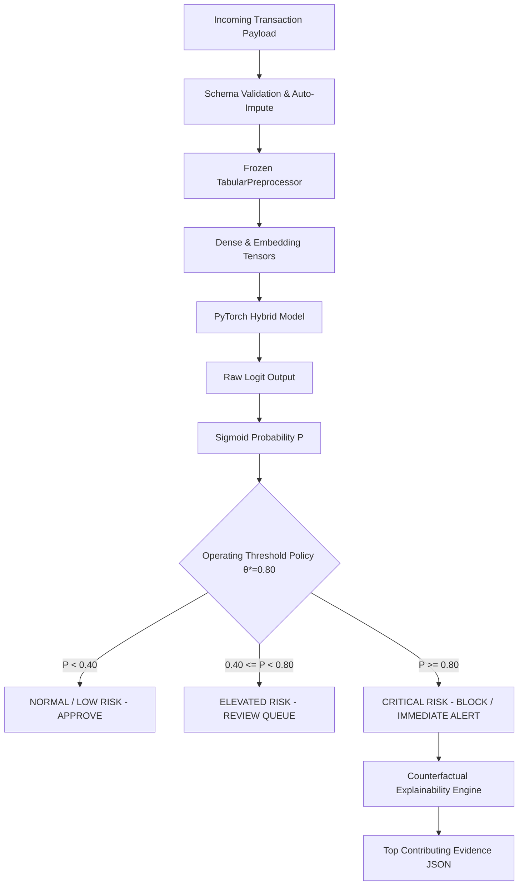

# End-to-End System Architecture Specification

## 1. High-Level System Architecture

The **Multimodal Financial Fraud / Risk Detector** is an end-to-end tabular deep learning system combining continuous transaction features, high-cardinality categorical entity embeddings, class-imbalance loss formulations, and cost-calibrated decision policies.

```
                           Raw Transaction Payload
                    (JSON / Streaming Message / Batch Row)
                                       │
                                       ▼
                   ┌───────────────────────────────────────┐
                   │  Input Validation & Schema Sanitize   │
                   │  (Vectorized Nan Imputation & Typing) │
                   └───────────────────┬───────────────────┘
                                       │
                   ┌───────────────────┴───────────────────┐
                   │                                       │
                   ▼                                       ▼
       [381 Numerical Features]                [49 Categorical Features]
                   │                                       │
                   ▼                                       ▼
        Frozen TabularPreprocessor              Categorical Index Mapper
       (Median Imputation + Standard            (Vocab Lookup: 0=<MISSING>,
            Scaler Parameters)                         1=<UNK>)
                   │                                       │
                   ▼                                       ▼
         Continuous Float Tensor                 Integer Index Tensor
               [Batch, 381]                          [Batch, 49]
                   │                                       │
                   │                                       ▼
                   │                            49 Entity Embedding Tables
                   │                           (Dim: min(50, round(6*V^0.25)))
                   │                                       │
                   │                                       ▼
                   │                             Concatenated Embeddings
                   │                                   [Batch, 568]
                   │                                       │
                   └───────────────────┬───────────────────┘
                                       ▼
                       Feature Concatenation Layer
                                       │
                                       ▼
                          Combined Representation
                          [Batch, 949 Dimensions]
                                       │
                                       ▼
                        BatchNorm1d(949) Normalization
                                       │
                                       ▼
                           Dense Block 1: 949 ➔ 256
                       (Linear + BatchNorm + ReLU + Drop 0.30)
                                       │
                                       ▼
                           Dense Block 2: 256 ➔ 128
                       (Linear + BatchNorm + ReLU + Drop 0.30)
                                       │
                                       ▼
                           Dense Block 3: 128 ➔ 64
                       (Linear + BatchNorm + ReLU + Drop 0.20)
                                       │
                                       ▼
                           Output Projection: 64 ➔ 1
                                       │
                                       ▼
                               Raw Fraud Logit [N]
                                       │
                   ┌───────────────────┴───────────────────┐
                   │                                       │
                   ▼                                       ▼
            [Training Mode]                        [Inference Mode]
                   │                                       │
        Weighted BCE / Focal Loss                          ▼
     (pos_weight=28.0, gamma=3.0)                   Sigmoid Function
                   │                                       │
                   ▼                                       ▼
           Gradient Backprop                      Fraud Probability P
                                                     [0.0000 - 1.0000]
                                                           │
                                                           ▼
                                                Operating Threshold Policy
                                                      (θ* = 0.80)
                                                           │
                                   ┌───────────────────────┴───────────────────────┐
                                   ▼                                               ▼
                              P < 0.80                                         P ≥ 0.80
                            [APPROVE]                                   [FLAG FOR MANUAL REVIEW]
                                   │                                               │
                                   ▼                                               ▼
                        NORMAL / LOW RISK                                  ELEVATED / CRITICAL
                        (Review Queue Saved)                             (+ Counterfactual Evidence)
```

---

## 2. Mathematical Component Breakdown

### 2.1 Categorical Entity Embedding Formulation
For each categorical feature $j \in \{1, \dots, 49\}$, an embedding matrix $\mathbf{E}_j \in \mathbb{R}^{V_j \times d_j}$ is learned:
$$d_j = \min\left(50, \max\left(4, \text{round}\left(6 \times V_j^{0.25}\right)\right)\right)$$
Where $V_j$ is the cardinality (including index 0 for `<MISSING>` and index 1 for `<UNK>`).
The total embedding dimension across all 49 categorical features is:
$$\sum_{j=1}^{49} d_j = 568$$

### 2.2 Deep Multilayer Perceptron (MLP)
The concatenated input vector $\mathbf{h}_0 \in \mathbb{R}^{949}$ is defined as:
$$\mathbf{h}_0 = \left[ \mathbf{x}_{\text{num}} \,\|\, \mathbf{e}_1(c_1) \,\|\, \dots \,\|\, \mathbf{e}_{49}(c_{49}) \right]$$
The forward pass through the hidden layers:
$$\mathbf{h}_1 = \text{Dropout}_{0.30}\left(\text{ReLU}\left(\text{BatchNorm}\left(\mathbf{W}_1 \mathbf{h}_0 + \mathbf{b}_1\right)\right)\right), \quad \mathbf{W}_1 \in \mathbb{R}^{256 \times 949}$$
$$\mathbf{h}_2 = \text{Dropout}_{0.30}\left(\text{ReLU}\left(\text{BatchNorm}\left(\mathbf{W}_2 \mathbf{h}_1 + \mathbf{b}_2\right)\right)\right), \quad \mathbf{W}_2 \in \mathbb{R}^{128 \times 256}$$
$$\mathbf{h}_3 = \text{Dropout}_{0.20}\left(\text{ReLU}\left(\text{BatchNorm}\left(\mathbf{W}_3 \mathbf{h}_2 + \mathbf{b}_3\right)\right)\right), \quad \mathbf{W}_3 \in \mathbb{R}^{64 \times 128}$$
$$z = \mathbf{W}_4 \mathbf{h}_3 + b_4, \quad \mathbf{W}_4 \in \mathbb{R}^{1 \times 64}$$

### 2.3 Numerically Stable Loss Formulations
* **Weighted Binary Cross-Entropy with Logits**:
  $$\mathcal{L}_{\text{WBCE}}(z, y) = - \left[ w_{\text{pos}} \cdot y \log \sigma(z) + (1 - y) \log (1 - \sigma(z)) \right]$$
  Where $w_{\text{pos}} = \frac{N_{\text{neg}}}{N_{\text{pos}}} \approx 28.0$.
* **Focal Loss with Logits**:
  $$p_t = y \sigma(z) + (1 - y)(1 - \sigma(z))$$
  $$\mathcal{L}_{\text{Focal}}(z, y) = - \alpha_t (1 - p_t)^\gamma \log(p_t)$$
  Where $\gamma \in \{1.0, 2.0, 3.0\}$ down-weights easily classified legitimate transactions.

---

## 3. Operational Inference Pipeline Specification



### 3.1 Zero Data Leakage Guarantee
1. **Split-Before-Fit**: The dataset was chronologically sorted by `TransactionDT` and partitioned ($70\%$ Train, $15\%$ Validation, $15\%$ Test) *prior* to fitting any transformers.
2. **Frozen Preprocessing Artifacts**: `tabular_preprocessor.joblib` is immutable in production. Incoming inference payloads are transformed using precomputed medians, standard scaling constants ($\mu, \sigma$), and category-to-integer mappings.
3. **Threshold Calibration on Validation Only**: The operating threshold $\theta^* = 0.80$ was tuned strictly on validation set predictions, preventing test-set data snooping.
